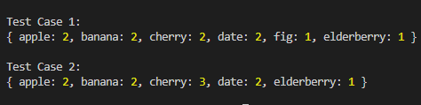

<h1>Basic javascript questions</h1>
 
 

<h4>Question 1</h4>
If the given input is an array of numbers, return the sum of all the positives ones. If the array is empty or there aren't any positive numbers, return 0.

<h4>Question 2</h4>
Calculate the mean and median values of the number elements from the input array.

<h4>Question 3</h4>
The given input is a string of multiple words with a single space between each of them. Abbreviate the name and return the name initials.

<h4>Question 4</h4>
Find the difference in age between the oldest and youngest family members, and return their respective ages and the age difference.

<h4>Question 5</h4>
If the given input is a number, you should return the factorial of that number. The factorial of a natural number n is the product of the positive integers less than or equal to n. So, 2! = 2, 3! = 6, 4! = 24 and so on.

<h4>Question 6</h4>
Count the occurrences of distinct elements in the given 2D array. The given input is an array, the elements of which are arrays of strings. The result is an object whose property names are the values from the arrays and their value is the number of their occurrences.

